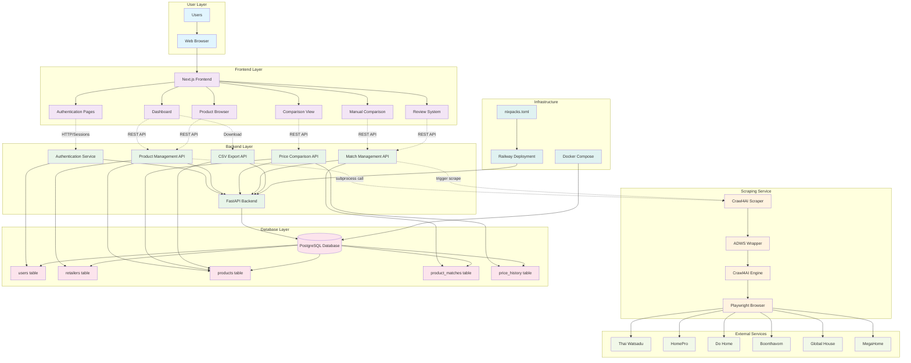

# PriceHawk System Architecture

## Architecture Components

### 1. **Frontend Layer (Next.js)**
- **Authentication Pages**: Login/logout functionality
- **Dashboard**: Product overview and statistics
- **Product Browser**: Searchable product listings
- **Comparison View**: Side-by-side product comparisons
- **Manual Comparison**: Tool for adding product comparisons
- **Review System**: Interface for verifying AI matches

### 2. **Backend Layer (FastAPI)**
- **Authentication Service**: Session-based auth with HTTP-only cookies
- **Product Management API**: CRUD operations for products
- **Price Comparison API**: Real-time price comparison logic
- **Match Management API**: Product matching verification
- **CSV Export API**: Data export functionality

### 3. **Scraping Service**
- **Crawl4AI Engine**: AI-powered web scraping
- **Playwright Browser**: Browser automation
- **ADWS Wrapper**: Custom scraper interface
- **Multi-retailer Support**: Handles 6 major Thai retailers

### 4. **Database Schema**
- **users**: User authentication and sessions
- **retailers**: Supported e-commerce platforms
- **products**: Product information and pricing
- **product_matches**: Cross-retailer product relationships
- **price_history**: Historical price tracking

### 5. **External Retailers**
- Thai Watsadu
- HomePro
- Do Home
- Boonthavorn
- Global House
- MegaHome

### 6. **Infrastructure**
- **Docker Compose**: Database containerization
- **Railway**: Cloud deployment platform
- **nixpacks**: Build configuration for Railway

## Data Flow

1. **Scraping Process**:
   - Scheduled/triggered scraping calls Crawl4AI
   - Playwright browser extracts product data
   - Data validated and stored in PostgreSQL

2. **Matching Process**:
   - Products algorithmically matched across retailers
   - AI generates confidence scores
   - Users verify matches through review system

3. **User Interaction**:
   - Web interface provides real-time price comparisons
   - Users can export data via CSV
   - Manual comparison tools available

## Technology Stack

- **Frontend**: Next.js 14, TypeScript, Tailwind CSS
- **Backend**: FastAPI, Python, PostgreSQL
- **Scraping**: Crawl4AI, Playwright
- **Deployment**: Railway, Docker
- **Database**: PostgreSQL 16